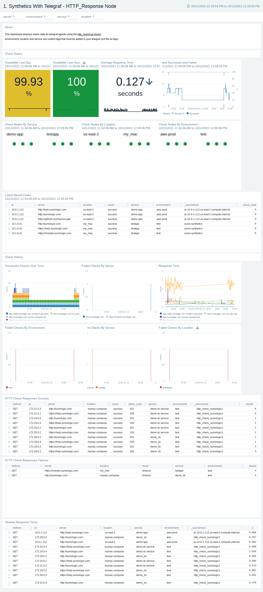
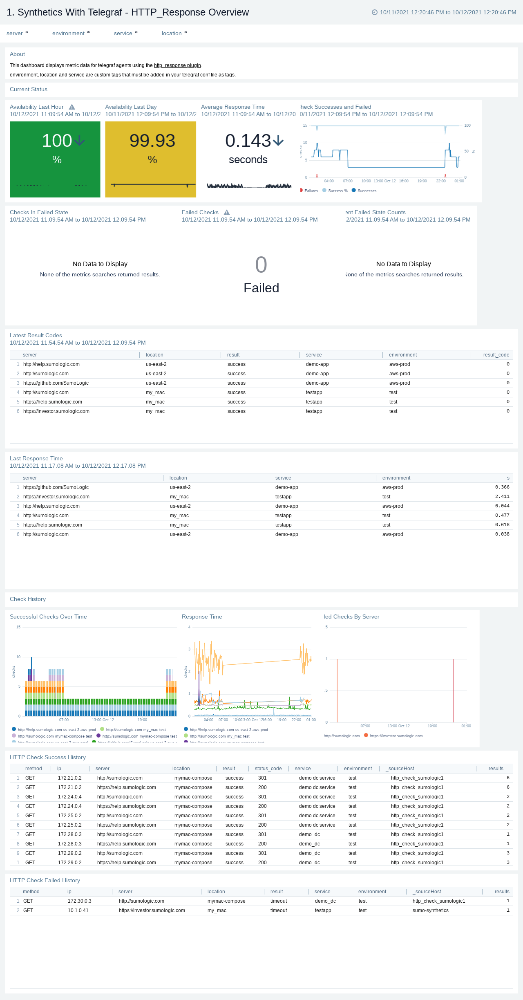
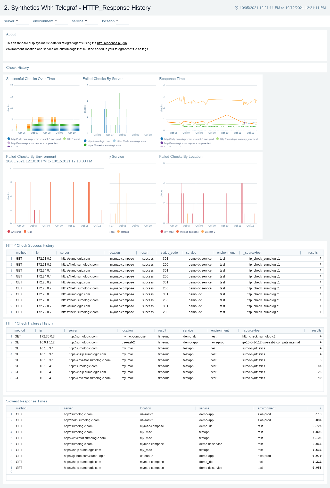
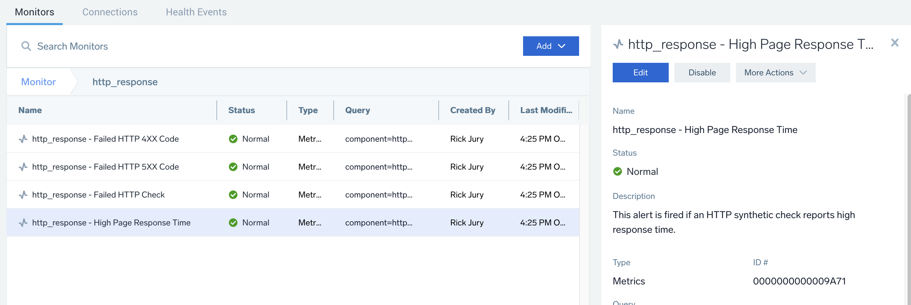

# http_response 
A common use case for observability or monitoring is to execute regular synthetic HTTPS checks vs key applications to ensure an application or service is running. It can be useful to be able to run these checks from one or more locations within your cloud or datacenter environments.

The open source telegraf http_response input plugin provides an easy to configure solution to setup synthetic HTTP checks.

```
component=http_response
```

Containerised synthetic http check as per: https://github.com/influxdata/telegraf/tree/master/plugins/inputs/http_response

For a simple example of running this container to poll several sites every minute via kubernetes see: orchestration/docker-k8s/pod.yaml

## env vars
See: [env_vars.md](env_vars.md)

- urls - hosts to send ping packets to. to define multiple hosts supply as csv list for example: ```a,b,c```

## run
```
docker run -it -e SUMO_URL="$SUMO_URL"  -e service=mywifi -e env=prod -e location=study rickjury/sumo-telegraf-agent telegraf --config internet_speed.conf
```

## example searches
```
# result codes
component=http_response metric=http_response_result_code  
| max by server,environment,location,service,result,_sourcehost,ip

# success
component=http_response metric=http_response_result_code 
| filter max =0 
| count by service,environment,server,location |

# failure
component=http_response metric=http_response_result_code 
| filter max >0 
| count by service,environment,server,location 

# http response codes for success checks
component=http_response metric=http_response_result_code result=success
| count by server,environment,location,service,method,status_code,result,_sourcehost,ip

```

## dashboard app
see: https://github.com/rjury-sumo/sumo-telegraf-examples/tree/main/complete-apps/http_response

### dashboard screenshots




## monitors
see: https://github.com/rjury-sumo/sumo-telegraf-examples/tree/main/monitors



