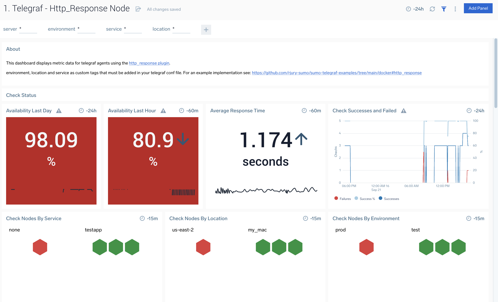
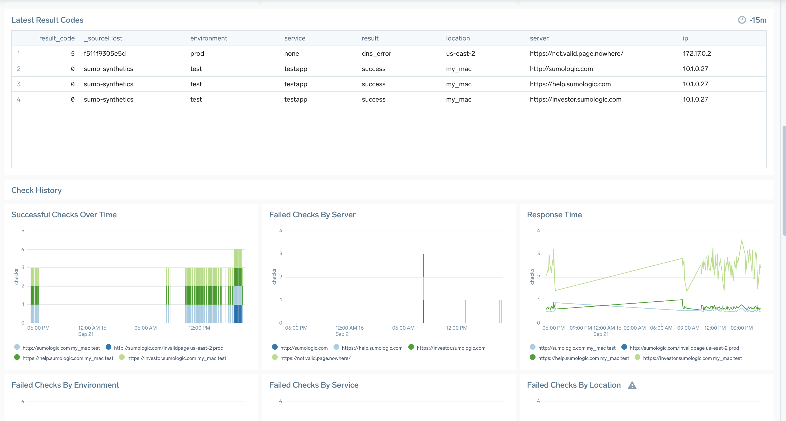

# http_response 
```
component=http_response
```

Containerised synthetic http check as per: https://github.com/influxdata/telegraf/tree/master/plugins/inputs/http_response

For a simple example of running this container to poll several sites every minute via kubernetes see: docker/orchestration/docker-k8s/pod.yaml

## env vars
See: [env_vars.md](env_vars.md)

- urls - hosts to send ping packets to. to define multiple hosts supply as csv list for example: ```a,b,c```

## run
```
docker run -it -e SUMO_URL="$SUMO_URL"  -e env=prod -e urls='http://sumologic.com,https://support.sumologic.com' -e location=living_room rickjury/sumo-telegraf-agent telegraf  --config http_response.conf
```

## dashboard app
see: https://github.com/rjury-sumo/sumo-telegraf-examples/tree/main/complete-apps/http_response

### dashboard screenshots




## monitors
see: https://github.com/rjury-sumo/sumo-telegraf-examples/tree/main/monitors


