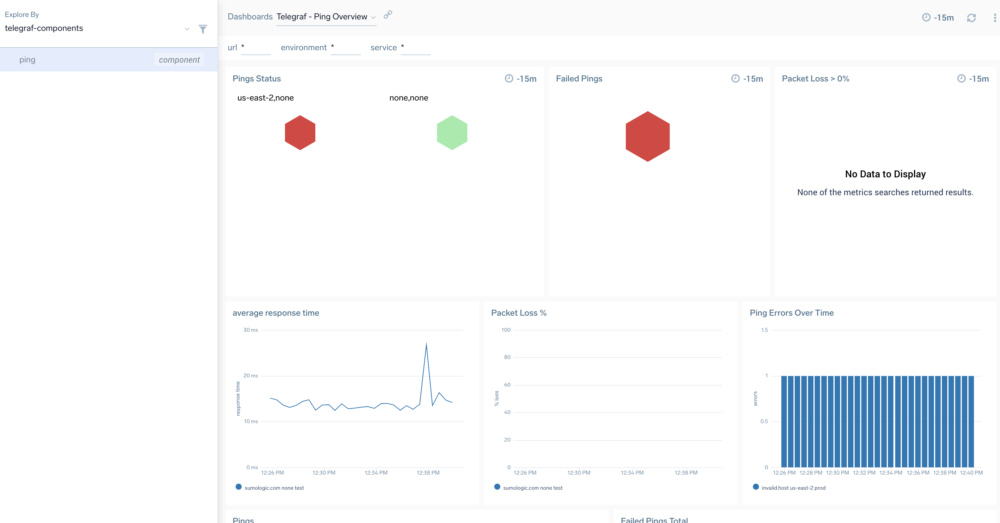

# ping
```
component=ping
```
Containerised synthetic ping check as per: https://github.com/influxdata/telegraf/tree/master/plugins/inputs/ping

## env vars
See: [env_vars.md](env_vars.md)

- urls - hosts to send ping packets to. to define multiple hosts supply as csv list for example: ```a,b,c```

## run
```
docker run -it -e SUMO_URL="$SUMO_URL"  -e env=test -e urls='somehost,invalid.host' rickjury/sumo-telegraf-agent telegraf  --config ping.conf
```

## example searches

```
_sourcecategory=metrics/telegraf component=ping metric=ping_result_code

# failed ping
_sourcecategory=metrics/telegraf component=ping metric=ping_result_code 
| filter max > 0
| max by url,environment,location,service 

# average response time
_sourcecategory=metrics/telegraf component=ping metric=ping_average_response_ms 
| avg by url,environment,location,service,environment
```

## dashboard app
see: https://github.com/rjury-sumo/sumo-telegraf-examples/tree/main/complete-apps/ping

### example dashboard


## example monitors
see: https://github.com/rjury-sumo/sumo-telegraf-examples/tree/main/monitors